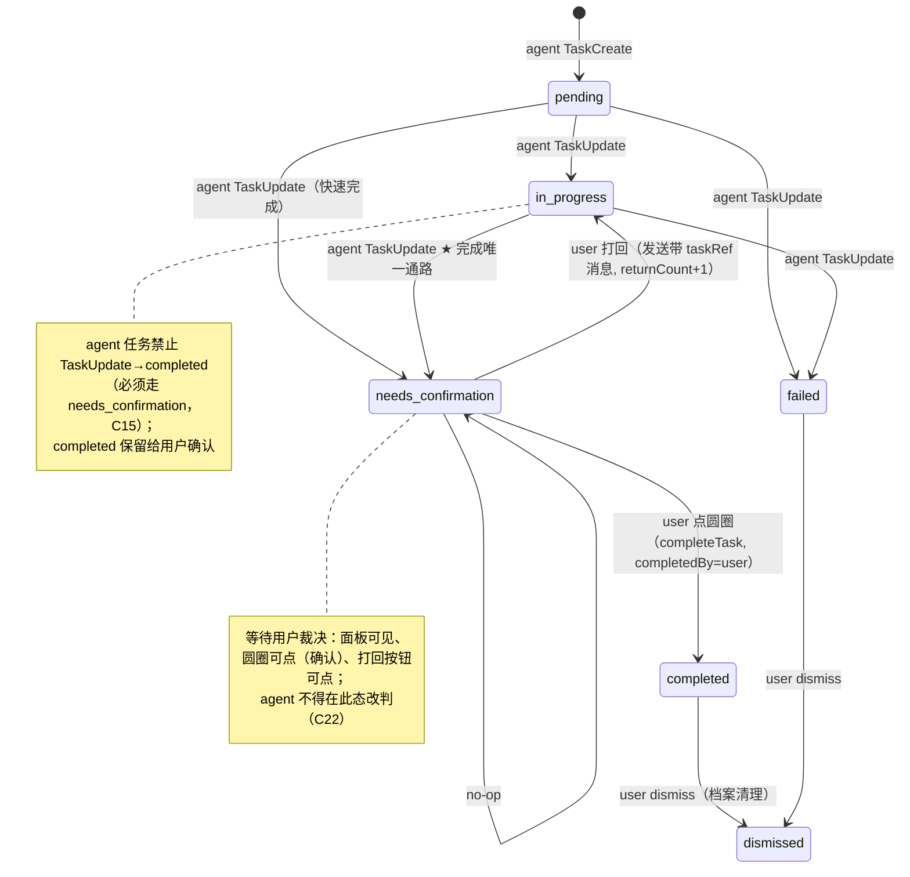

# 任务面板：五状态生命周期 v2 + 双区设计 v3 · 设计规格书

> **状态**：**v3 draft**（2026-08-19 design-engineer 初稿，待用户终审冻结）· **v2 已实现**（44d2e93f + 9639a226 → HEAD c1959941，本文件 v2 章节冻结为 v2 基线；v3 增量见 §15）· **创建**：2026-08-17 23:17（v1）· **域**：Nebflow 客户端 src/main/resources/web/ + core/task
> **输入**：用户需求 2026-08-17 20:58/21:33/21:44（v1 三次合成）· **[U4 2026-08-19 11:15 用户裁定]**：「把任务分 创建 进行 完成（需用户确认） 用户打回 用户确认（完成） 这几种状态来设计我们的任务栏。用户确认就是像点击确认完成提醒事项一样。用户打回就是像@一样，把这个任务的信息，添加到输入框的引用，类似于文件那样。然后这样用户就可以把意见传给你。」· **[U5 2026-08-19 19:47 用户裁定]**：「我看到待办区了，稍微优化一下。就是要设计一下。待办和任务。两个区。因为一个是用来展示agent任务进展的。一个是用来人确认的。现在两个区的内容混在一起而且样式一样。所以需要设计一下。」
> **v1 基线**：v1.2 frozen（[U3 完成即消失] + C12-C14）——**v2 是演进非推翻**，差异清单见 §13；v1 的 §0-§14 全部章节在 v2 下有效条款原位保留，本节仅为修订增量。
> **铁律依据**：~/.nebflow/skills/nebflow/visual-style/SKILL.md（毛玻璃面板/玻璃控件/中字重/克制）· 案例库 案例 001（i18n key 先行 / 显式语义 / 增量口径）
> **代码基线**：js/taskList.js（renderTodayBar 移除）· js/taskArchive.js（保留）· js/{input,chat}.js（#attachment-preview 附件机制）· core/task/{TaskModel,TaskStore}.scala · gateway/WebSocketRoutes.scala（completeTask / dismissTask / 默认用户消息分支）

## 0. 一句话目标

把 Agent 任务从 v1「agent 自动流转、人类不点」升级为**五状态生命周期**（创建 → 进行 → 完成待确认 → 用户确认 / 用户打回）：agent 干完不再直接置 completed，而是落到**待确认（needs_confirmation）**等待用户裁决；用户点圆圈 = **确认完成**（与人类待办点圆圈完成交互完全一致，[U4] 点名「像点击确认完成提醒事项一样」，完成即消失 [U3] 延续）；用户点打回 = 把该任务信息（标题/描述/产出）以**引用块插入输入框**（[U4] 点名「像@一样…类似于文件那样」——交互形态复用现有文件附件 chips），用户在引用下方附上意见发送，**意见连同任务上下文路由回负责该任务的 agent**，任务回到「进行」继续改（可多轮：待确认 ⇄ 进行，returnCount 累计）。**人类待办分治不变**（点圆圈即完成即消失，无打回无待确认）。

## 1. 参考与依据

| 来源 | 提炼规则 | 链接 |
|---|---|---|
| **[U4 2026-08-19 11:15 用户裁定]**（本项目最高优先级） | 五状态定义（创建/进行/完成需确认/用户打回/用户确认）；确认 = 提醒事项点圆圈；打回 = 像 @ 一样把任务信息插入输入框引用（类文件附件）；意见随消息传给 agent | 用户原话，见文件头输入行 |
| Apple Reminders（用户点名范式，v1 §1 沿用） | 点圆圈完成交互；[U3]「完成即消失」延续至确认圆圈 | https://support.apple.com/guide/reminders/welcome/mac |
| 微信 / 文件引用交互（[U4]「像@一样」「类似于文件那样」） | 引用 = 结构性引用块入输入区（非纯文本内联），用户可在引用下方补写意见，引用可删除，发送后引用随消息携带上下文 | 产品行为观察（微信会话引用 / 文件发送） |
| 既有附件机制（本仓，零新机制） | `#attachment-preview` chips（`.att-file` + `.att-remove` ×，input.js addFileAttachment / chat.js renderAttachmentPreview）是引用块现成容器：渲染/删除/队列/草稿/持久化全继承，新增 `.att-taskref` 类型即可 | src/main/resources/web/js/{input,chat}.js · css/input.css:56-98 |
| Apple HIG · Feedback | 用户裁决点要有明确的等待语义与响应；「谁的动作触发什么反馈」显式 | https://developer.apple.com/design/human-interface-guidelines/ |
| WAI-ARIA APG · Checkbox（v1 §9 沿用） | 确认圆圈 role=checkbox + aria-checked + Space/Enter；打回按钮 role=button | https://www.w3.org/WAI/ARIA/apg/patterns/checkbox/ |
| nebflow/visual-style 铁律（最高优先级） | 面板毛玻璃不变；打回按钮/引用块按玻璃控件语义（淡底+blur+立体边）；中字重（400/500）；克制——零新增颜色 token，引用块仅 sapphire 透明度变体 | ~/.nebflow/skills/nebflow/visual-style/SKILL.md |
| 案例库 案例 001 踩坑共性 | 二值断言口径显式到可执行：文案→i18n key、顺序→显式状态语义、布局→增量基线口径。v2 §10 B1-B14 全部按此锁死 | ~/.nebflow/skills/design-system/SKILL.md 案例 001 |

**范式取舍（C18）**：打回引用采用「结构化引用块入输入区（复用附件 chips）」而非「文本内联 @mention 语法解析」——[U4]「像@一样」「类似于文件那样」指**交互语义**（把任务信息插进输入框作引用、可删除、发送携带上下文），非字面 @ 语法；输入框为纯 textarea 无富文本，附件 chips 是既有成熟机制，零新机制成本。「确认」沿用提醒事项圆圈（[U4] 点名），不另造「通过/拒绝」双按钮。

## 2. 五状态生命周期（核心）

### 2.1 状态定义（agent 任务）

| # | 状态 | wire status | 语义 | 进入触发（谁） |
|---|---|---|---|---|
| 1 | 创建 | `pending` | 已创建排队 | agent TaskCreate |
| 2 | 进行 | `in_progress` | agent 执行中 | agent TaskUpdate(in_progress) |
| 3 | **完成待确认** | **`needs_confirmation`**（新） | agent 干完产出，等待用户裁决；面板行圆圈可点（确认）+ 打回按钮可点 | agent TaskUpdate(needs_confirmation) |
| 4a | 终态 · 用户确认 | `completed`（completedBy=user） | 用户点圆圈确认 → 完成即消失（[U3] 延续） | user 点圆圈（WS completeTask） |
| 4b | 用户打回（回 #2） | `in_progress`（+returned 记录） | 用户打回并附意见 → 任务回「进行」，意见持久化 | user 发送带 taskRef 的消息 |

**裁定 C17**：「用户打回」**不是独立持久状态**——它是 needs_confirmation → in_progress 的一次转换，附带 `returnCount+1`、意见落 notes、事件流记录（§2.4）。面板上打回后的任务以 in_progress 呈现（spinner 行，无「已打回」独立外观），避免状态爆炸；打回痕迹（次数/意见/时间）在任务事件流与 notes 可见、入档案（C20）。

### 2.2 状态机转换图



转换矩阵（agent 任务；TaskUpdate = agent 路径，complete/return = user 路径）：

| from \ to | pending | in_progress | needs_confirmation | completed | failed | dismissed |
|---|---|---|---|---|---|---|
| pending | ✔no-op | ✔agent | ✔agent | ✘（C15 禁直通） | ✔agent | ✔ |
| in_progress | ✘ | ✔no-op | ✔agent | ✘（C15 禁直通） | ✔agent | ✔ |
| needs_confirmation | ✘ | ✔**仅 user 打回**（return） | ✔no-op | ✔**仅 user 确认**（complete） | ✘（C22：等待裁决期 agent 禁改判） | ✔（user dismiss） |
| completed | ✘ | ✘ | ✘ | ✔no-op（幂等，C11 沿用） | ✘ | ✔ |
| failed | ✘ | ✘ | ✘ | ✘（v1 沿用） | ✔no-op | ✔ |
| dismissed | ✘ | ✘ | ✘ | ✘ | ✘ | ✔no-op |

**人类待办（taskKind=human）转换与 v1 完全相同**：pending → completed（user 圆圈 / agent 代勾）、pending → failed、* → dismissed；**禁止进入 in_progress（v1 已有）与 needs_confirmation（新增）**。

### 2.3 触发者与责任（谁触发）

| 转换 | 触发者 | 前端控件 | 后端入口 |
|---|---|---|---|
| → needs_confirmation | agent（TaskUpdate 工具） | 无新控件——行自动变「待确认」态 | TaskStore.update(status=NeedsConfirmation) |
| → completed（确认） | user | 待确认行圆圈点击（与 human pending 圆圈同构） | WS `completeTask`（completedBy=user，v1 §7.1 沿用） |
| → in_progress（打回） | user | 打回按钮 → 引用块入输入框 → 用户附意见发送（带 taskRef 的用户消息） | 默认用户消息分支 + taskRefs 处理（§6） |

### 2.4 打回语义（durable 记录）

用户发送带 taskRef 的消息时，后端对每个 taskRef 执行一次「打回转储」（TaskStore.return，§6.2）：

1. **校验**：status == needs_confirmation 且 taskKind == "agent"（human 任务无打回概念 → taskError；非待确认态 → taskError 区分文案，§6.3）
2. **转换**：→ in_progress
3. **记录**：`returnCount = existing.returnCount + 1`；事件流追加 `status: needs_confirmation→in_progress` + `returned: 用户意见（前 120 字）`；notes 追加 `TaskNote(content = 用户意见全文, at = now)`——**意见随任务持久化**（C20），档案/复盘/agent 后续轮次可读
4. **回推**：taskListUpdate（任务行回「进行」态，spinner）

**裁定 C16（打回绑定发送，不绑定按钮）**：点打回按钮 = **起草**（引用块入输入框，任务仍待确认）；用户发送（带引用的消息）= **生效**（状态转换）。理由：意见未发出前不算打回；避免误点即打回（恢复成本高）；两阶段（起草→发送）与文件附件发送心智一致。用户在起草窗口内可改主意点圆圈确认（任务已确认则发送时后端校验失败 → 引用移除 + toast，§6.3）。

## 3. 布局与信息架构（增量）

> **v3 修订**：分区模型按**操作归属**重构（待办区/任务区），本节 v2 布局树被 §15.2 取代；v2 内容保留作基线。

面板结构沿用 v1 §3.1（.task-card 毛玻璃浮窗、组头分治、header = toggle + stats + archive 按钮），**仅 Agent 组行内增量**：

```
.task-card（--glass-bg + blur，现状不变）
├─ .task-header（toggle + 单计数 stats + archive 按钮，v1 不变）
├─ .task-body
│   ├─ [组头] 人类待办（task.sectionHuman）      ← 仅当双类并存（v1 不变：圆圈可点、完成即消失）
│   ├─ [组头] Agent 任务（task.sectionAgent）    ← 仅当双类并存
│   │   ├─ .task-item.task-needs-confirmation    ← 新：待确认行
│   │   │   ├─ .task-check.task-check-clickable  ← 圆圈可点 = 确认完成（与 human 同构）
│   │   │   ├─ .task-item-text
│   │   │   │   └─ .task-label（subject，常规字重 400）
│   │   │   ├─ .task-status-word「待确认」        ← 新：11px muted 状态词（B2 断言选择器）
│   │   │   └─ .task-return-btn「↩ 打回」        ← 新：行右端玻璃按钮（B2 断言选择器）
│   │   └─ .task-item（pending/in_progress/failed，v1 呈现不变）
│   └─（needs_confirmation 行确认后即消失，[U3] 延续——不驻留面板）
└─ ✕ .task-today-wrap —— v1 已删除，不复活
```

**排序修订（C19）**：组内排序 rank = **needs_confirmation 0** > in_progress 1 > pending 2 > failed 3（同 rank 按 createdAt 升序，failed 沉底沿用 v1）。理由：待确认行需要**用户**行动，可见性优先级最高——与「人类组恒在上」（C4）同一逻辑（需要人行动的优先进入视野）；agent 正在做的次之。

**计数修订**：header 单计数 `activeCount` = pending + in_progress + **needs_confirmation**（待确认未终态，属「还没干完」，计入；completed/failed 不计，v1 §3.3 口径其余不变）。

## 4. 交互状态机表（增量）

圆圈（.task-check）新增 **agent needs_confirmation 可点态**——与 human pending 完全同构（[U4]「像点击确认完成提醒事项一样」）：

| 状态 | 视觉 | 触发 → 结果 |
|---|---|---|
| agent needs_confirmation default | 空心圆 1.5px border muted 40%、20×20 热区（同 human pending），cursor:pointer | hover → hover 态 |
| hover（确认圆圈） | 边框转 rgb(var(--sapphire)) + 圆内底 rgba(var(--sapphire)/0.08) + 勾预览 0.35（沿用 .task-check-clickable:hover，v1 §4/§6） | leave → default；click → confirming |
| confirming（确认完成） | 填充 sapphire+白勾 ~180ms → 高度塌缩 ~220ms → 条目从 DOM 移除（复用 v1 §5 completing 动效；乐观消失 + taskError 回滚重现，v1 §7.2 原样） | completeTask 成功回推 → 收敛不复现；taskError → 原位回滚 + toast(task.completeError) |
| agent pending / in_progress / failed | v1 只读呈现不变（空心只读 / spinner / 红×） | 不可点 |
| **打回按钮**（.task-return-btn）default | 行右端：lucide `corner-up-left` 13px + 文案 11px/500；default 底/边透明（不占位宽、无布局位移） | hover → 玻璃底（--glass-control-bg-hover + blur + 淡边框 + 立体边，铁律 2）；click → 引用块入输入框（§5）+ 输入框聚焦 |
| 打回按钮 disabled（WS 断连） | opacity 0.5、cursor:not-allowed（与圆圈 disabled 同律，.task-ws-down 作用域） | 不可点 |
| 状态词（.task-status-word） | 11px / 400 / var(--color-text-muted)，行右端、打回按钮左侧，flex-shrink:0，max-width 64px ellipsis | 非交互（aria-hidden，状态由行 aria-label 承载，§9） |
| 引用块（.att-taskref，输入区） | §5.2 | × 删除（仅本地，任务不动）；发送携带（§6） |
| error（打回失败） | toast（notificationBanner 通道，4s 沿用 C13）+ 引用块移除 + 任务行经回推收敛保持待确认 | 用户可重试 |
| loading / empty / 组头 / archive | v1 不变 | — |

**待确认行无 hover 底色、无边框高亮**——克制：状态由「圆圈可点 + 状态词 + 打回按钮」三个控件自表达，不加行级装饰（§8）。

## 5. 打回引用块设计（精确到 DOM/CSS）

### 5.1 数据源与内容

点打回按钮时，取该任务的**前端快照**（state.sessionTasks[sessionId] 中的 Task 对象，行上 data-session-id 已带 sessionId）构造引用对象：

```js
{
  type: 'taskRef',                 // 与文件/图片附件同数组（pendingAttachments），type 区分
  taskId: task.id,
  sessionId: task.sessionId,       // 必须 === 发送帧 sessionId（后端校验，§6.2）
  subject: task.subject,
  description: task.description,
  output: task.notes?.[task.notes.length - 1]?.content || ''   // 产出 = 最近一条 note（agent 待确认时追加的完成说明）
}
```

快照时机 = 点击瞬间（后续 taskListUpdate 回推不影响已插入引用）。发送时后端以**权威状态**校验（引用中的快照仅供展示，不参与校验——防陈旧）。

### 5.2 插入位置与形态（复用 #attachment-preview 机制）

- **容器**：现有 `#attachment-preview`（输入框上方 chips 区，input.css:56，flex-wrap）——taskRef 与文件/图片附件同区展示
- **实现**：push 进 `view.pendingAttachments`（与 addFileAttachment 同数组）；`send()` 时拆分——`taskRefs = pendingAttachments.filter(a => a.type === 'taskRef')` 走独立 WS 字段，文件/图片走既有 attachments（§6.1）。队列（queueMessage/drainMessageQueue）、草稿（saveInputDraft）、持久化（persistQueue）全自动继承；persistQueue 序列化需为 taskRef 项补 taskId/sessionId（A15）
- **DOM 结构（精确，断言选择器）**：

```html
<div class="att-taskref" data-task-ref="<taskId>" data-task-session="<sessionId>"
     title="<全文：subject — description — output>">
  <i data-lucide="clipboard-list" class="att-taskref-icon"></i>
  <span class="att-taskref-subject">subject</span>
  <span class="att-taskref-meta">description（单行省略）</span>
  <span class="att-taskref-output">产出：output（单行省略）</span>
  <div class="att-remove" role="button" tabindex="0" aria-label="移除任务引用">x</div>
</div>
```

- **CSS（新，零新增颜色 token——仅 sapphire 透明度变体，案例 001 先例）**：

```css
.att-taskref {
  display: flex; align-items: center; gap: 6px;
  background: rgba(var(--sapphire) / 0.06);          /* 玻璃浅底，区别于文件 .att-file 灰底 */
  border: 1px solid rgb(var(--sapphire) / 0.25);
  border-radius: 6px; padding: 3px 8px;
  font-size: 11px; color: var(--color-text);
  position: relative;                                 /* .att-remove 绝对定位基线 */
}
.att-taskref-icon { color: rgb(var(--sapphire)); width: 13px; height: 13px; flex-shrink: 0; }
.att-taskref-subject { font-weight: 500; max-width: 140px; overflow: hidden; text-overflow: ellipsis; white-space: nowrap; }
.att-taskref-meta, .att-taskref-output { color: var(--color-text-muted); max-width: 160px; overflow: hidden; text-overflow: ellipsis; white-space: nowrap; }
@media (prefers-color-scheme: dark) { .att-taskref { background: rgba(var(--sapphire) / 0.10); } }
```

- **删除引用**：复用 `.att-remove`（×，右上红色圆钮，既有 input.css:86）；点击仅移除引用（本地），**任务状态不动**（仍待确认）；删除后焦点归还输入框
- **键盘**：chips 区 Tab 可达（× 为 role=button + tabindex=0），Space/Enter 触发删除；无引用时输入行为零变化

### 5.3 发送后的会话气泡呈现

renderUserBubble 的 att-bubble 分支新增：`att.type === 'taskRef'` → `.att-file-tag.att-taskref-tag`，内容 = lucide `clipboard-list` + `t('task.refBubbleLabel', {subject})`（打回：{subject}），无预览图。发送后引用块随附件清空（v1 附件行为），不驻留输入区。

### 5.4 引用内容与「意见」的协同

- 引用块插入后输入框 **placeholder 不变**（克制，不打断输入心智）
- 用户在引用下方直接输入意见（textarea 自然换行；纯引用无意见也可发送——打回仍生效，意见为空）
- 意见（content）与引用（taskRefs）同帧发送；后端将 content 作为该任务的打回意见落 notes（§2.4）；agent 注入块显式呈现「用户意见」，无意见时注入块注明「（未附意见）」并提示 agent 先询问或自查（§6.2）

## 6. 意见路由与后端 TaskStore 改动

### 6.1 WS 帧契约（前端 → 后端，打回发送）

复用默认用户消息路径（无 type 帧，WebSocketRoutes.scala:2965 起），**新增可选字段 `taskRefs`**（缺失/空数组 → 零行为变化，v1 路径原样）：

```json
{
  "content": "参考里第 2 条结论不对，重做",
  "taskRefs": [ { "taskId": "42" }, { "taskId": "43" } ],
  "attachments": [ /* 文件/图片，v1 原样 */ ],
  "clientMessageId": "...", "sessionId": "<sid>", "chatWidth": 0
}
```

- **sessionId 即帧内 sessionId**；taskRef 的 sessionId 必须 === 帧 sessionId（防跨会话注入，不符 → taskError）
- 前端 send() 拆分逻辑见 §5.2；一次消息可带多个 taskRefs（多任务同批打回）

### 6.2 后端处理序（默认用户消息分支内、UserInput 派发前插入）

```
1. 解析 taskRefs（parse 帧内字段；缺失/空 → 直接走 v1 路径）
2. 对每个 taskRef 依序处理：
   a. 校验 taskRef.sessionId（引用对象自带）=== 帧 sessionId（不符 → taskError{taskId, "跨会话引用" }）
   b. taskStore.return(sessionId, taskId, feedback = content)   ← 新增方法（§6.4）
      - 任务不存在 / status != needs_confirmation / taskKind == "human"
        → IllegalStateException → taskError{taskId}（错误文案区分：已确认完成 / 已打回 / 不存在 / 人类待办无打回）
      - 成功 → 转换 in_progress + returnCount+1 + notes 追加意见 + 事件流（§2.4）
   c. 构建注入块（追加进 blocks 尾部，紧跟 ContentBlock.Text(content) 之后，§5.4 序）：
      ContentBlock.Text(
        "[打回任务 #<id>: <subject>]\n" +
        "任务描述: <description>\n" +
        "产出: <notes.last.content 或 （无）>\n" +
        "用户意见: <content 或 （未附意见）>\n" +
        "（该任务已回到进行中，请按用户意见修改；改完重新置 needs_confirmation 待用户确认）"
      )
3. 回推 taskListUpdate（listVisible 全量，任务行现为 in_progress）
4. 既有逻辑继续：ensureAgent(sessionId) → AgentCommand.UserInput(content, None, clientMessageId, blocks, ...)
```

**路由语义（C21，[U4]「把意见传给你」）**：负责该任务的 agent = 会话 agent = 收到该消息的 agent——任务按 session 存储（taskStore 按 sessionId 分目录，TaskStore.scala:41）、面板只显示当前会话任务、打回消息发自同一会话输入框 → `ensureAgent(sessionId)` 天然路由到创建该任务的 agent，任务上下文（subject/description/产出/意见）随 blocks 注入该轮次。**跨 agent 委托（team 子任务在子会话）不在本期**——任务面板只呈现主会话任务，若未来任务挂 assignee 字段，路由随之扩展（§13 非目标）。

### 6.3 前端错误路径

taskError{taskId} 抵达 → 前端（沿用 v1 taskError 监听机制，taskList.js:111）：
1. 移除该 taskId 的引用块（本地 pendingAttachments 过滤）
2. toast t('task.returnError')（notificationBanner 通道，4s 沿用 C13）
3. 任务行以回推收敛（taskListUpdate）为准保持/回滚待确认态
- 引用删除仅本地（未发送前删除无后端副作用，任务不动）

### 6.4 TaskStore 改动清单

| 位置 | 改动 |
|---|---|
| `TaskStatus` enum | 新增 `NeedsConfirmation`；wireName → `"needs_confirmation"`；Codec 增解码分支（TaskModel.scala:18-41） |
| `Task` case class | 新增 `returnCount: Int = 0`（withDefaults 兼容，存量 535+ JSON 零迁移，C1 红线模式） |
| `isValidTransition` | 增补 §2.2 矩阵（needs_confirmation 行/列：→completed / →in_progress(return 专用) / no-op / →dismissed） |
| `isValidTransitionFor`（agent TaskUpdate 路径） | agent 任务：pending/in_progress → Completed 经 TaskUpdate **判非法**（C15，必须走 needs_confirmation）；human 任务：禁止 → InProgress（沿用）与 → NeedsConfirmation（新增） |
| **新方法 `return(sessionId, taskId, feedback: String): IO[Option[Task]]`** | §2.4 打回转储：校验（needs_confirmation + taskKind=agent）→ in_progress + returnCount+1 + notes 追加 + 事件流追加；镜像 complete() 的结构（TaskStore.scala:305） |
| `complete()` | 矩阵加 needs_confirmation → completed（completedBy=user 沿用）；幂等 C11 不变 |
| `renderForPrompt` | needs_confirmation 渲染为 `[needs_confirmation]` 标记（agent 可见「已完成待用户确认」，**不得重复执行**） |
| `TaskUpdateTool` description | 指导 agent：完成时置 needs_confirmation 并追加产出 note（taskUpdate note 字段）；**不得自置 completed** |

### 6.5 Agent 行为约束（prompt/工具层）

- TaskCreateTool / TaskUpdateTool description 更新：agent 任务的完成通路由 needs_confirmation（C15）；completed 保留给用户确认
- renderForPrompt 中 needs_confirmation 任务明确标注等待用户裁决
- 打回注入块把「用户意见」显式呈现；agent 应按意见修改、以新产出再置 needs_confirmation——**允许多轮循环**（needs_confirmation ⇄ in_progress，returnCount 累计），每轮意见追加进 notes 形成完整修订史

## 7. 动效规范（增量）

| 动效 | 触发 | 时长 / 缓动 | 位移/属性 | reduced-motion |
|---|---|---|---|---|
| 确认完成（圆圈填充+塌缩消失） | 待确认行圆圈 click | 180ms + 220ms（v1 §5 原样复用） | fill scale + height collapse | 瞬时移除（点击即从 DOM 消失） |
| 打回按钮 hover | hover | 150ms（沿用 .icon-btn 参数） | 底/边/阴影（glass-control 参数组） | 静态态变（无动画） |
| 引用块插入 | 点打回 | 180ms cubic-bezier(0.4,0,0.2,1) | opacity 0→1 + translateY(-4px)→0（transform-only） | 瞬时出现 |
| 引用块移除 | 点 × | 150ms ease | opacity→0 | 瞬时 |
| 待确认→进行（打回回推） | taskListUpdate | 400ms（沿用 task-icon-flip） | 圆圈位 rotateY → spinner | 瞬时 |

全部仅 transform/opacity/height，尊重 prefers-reduced-motion（全量瞬时化，B12）。确认完成的动效与 v1 人类待办完成完全一致（同构复用，零新动效）。

## 8. 视觉规格（token 引用）

全部引用既有 token，**零新增颜色 token**（引用块仅 sapphire 透明度变体，案例 001 先例）：

| 元素 | 规格 |
|---|---|
| 面板 / 组头 / 行骨架 | v1 §6 不变（.task-card 毛玻璃、组头 11px/500/muted、.task-item padding 3px 0 + gap 8px、.task-label 13px/400） |
| 待确认行 | **无底色、无边框、无 hover 行高亮**（克制——状态由三个控件自表达）；subject 常规字重 400（非 in_progress 的 500） |
| 确认圆圈 | 与 human pending 完全同构（v1 §6：20×20 热区、svg 14px、1.5px border muted 40%、hover sapphire、填充 sapphire+白勾） |
| 状态词 | 11px / 400 / var(--color-text-muted)，max-width 64px ellipsis，flex-shrink:0 |
| 打回按钮 | 行右端：lucide corner-up-left 13px + 文案 11px/500；default 底/边透明；hover 玻璃底（--glass-control-bg-hover + blur + 淡边框 + 立体高光/下缘，铁律 2）；focus-visible 2px rgb(var(--sapphire)/0.5) outline（v1 参数） |
| 引用块 | §5.2：sapphire 浅底（亮 0.06 / 暗 0.10）+ sapphire/0.25 边 + subject 500 + meta/output muted；× 复用 .att-remove（var(--color-error) 底白字） |
| 窄视口 480px | 状态词可先省略（max-width+ellipsis）；打回按钮文案可隐藏留图标（flex 吸收，增量口径 B13） |

**克制校验**：待确认行不引入任何新状态色（不造「琥珀色待确认」之类）——sapphire 圆圈 + muted 状态词即完成状态传达，符合铁律 6「复用既有设计语言，不造新轮子」。

## 9. 无障碍

- 确认圆圈：`role="checkbox"` + `aria-checked="false"` + `aria-label` = t('task.completeAria', {subject})（复用 v1 key——确认与 human 标记完成动作同构，共用一个语义）；Space/Enter 触发；tabindex=0
- 打回按钮：原生 `<button>`（role=button 隐式）+ `aria-label` = t('task.returnAria', {subject})；Tab 可达；Space/Enter 触发
- 引用块 ×：`role="button"` + `tabindex="0"` + `aria-label` = t('task.removeTaskRef')；删除后焦点归还输入框
- 状态词「待确认」：`aria-hidden="true"`（行 aria-label 已含状态，参考 v1 §9 只读图标先例，避免读屏重复报读）
- 对比度：状态词 muted ≥4.5:1（沿用 v1 核验口径）；引用块文字 var(--color-text) 落 sapphire 浅底上核验 ≥4.5:1（若不足调浅底透明度 0.06→0.04，token 不变）
- 全部动效尊重 prefers-reduced-motion（§7）
- Tab 序 = DOM 序：toggle → archive → 人类圆圈们 → 待确认行（圆圈 → 打回按钮）→ …（v1 基线 + 新控件自然入序）

## 10. 可断言验收点

> **v3 修订**：新增 D1-D12（§15.10）；A9（计数）与 B11（计数/排序）口径按 C24/C26 修订，以 D4/D11 为准。

全部二值判断；口径显式到可执行（案例 001 共性纪律：文案→i18n key 运行时 locale 输出比对、顺序→显式状态语义、布局→增量基线口径）。qa-frontend 转 Playwright。**v1 §10 A1-A13 全部继续有效（回归基线）**，下方为 v2 新增 B1-B15：

| # | 断言 | 口径 | 需截图 |
|---|---|---|---|
| B1 | 状态 wire | mock agent 任务经 TaskUpdate(status=needs_confirmation)，taskListUpdate 帧中该任务 `status === "needs_confirmation"` | 否 |
| B2 | 待确认行三要素 | needs_confirmation 行内存在：`[role="checkbox"]`（可点圆圈）+ `.task-status-word`（textContent === t('task.needsConfirmation') 运行时输出）+ `.task-return-btn` | 是（亮/暗各一） |
| B3 | 确认即消失（复用 v1 A3/A4/A7 同构） | 待确认行点圆圈 → WS 出站帧 `{"type":"completeTask","sessionId":<sid>,"taskId":<id>}` 字段逐一比对 → ≤600ms 该行 `[data-task-id]` 为 null（乐观消失）；注入 taskListUpdate(status=completed) 后不复现 | 是（勾选动画） |
| B4 | 打回入引用 | 点打回按钮 → `#attachment-preview` 出现 `.att-taskref[data-task-ref="<id>"]`，`.att-taskref-subject` textContent === 任务 subject；点 × 后该引用为 null 且任务行仍 needs_confirmation（DOM 序） | 是（引用插入态） |
| B5 | 打回发送帧 | 带引用发送 → WS 帧含 `taskRefs:[{"taskId":"<id>"}]` 且帧 sessionId === 行 data-session-id | 否 |
| B6 | 后端打回转储 | 发送后：taskListUpdate 中该任务 `status === "in_progress"`；磁盘 JSON（tasks/<sid>/<id>.json）中 `returnCount === 1`、notes 末条 `content === 帧 content` | 否 |
| B7 | 意见路由注入 | 该会话 agent 轮次输入包含注入块：含任务 subject 与子串「用户意见: <content>」（mock agent / 消息日志捕获断言） | 否 |
| B8 | 非待确认打回拒绝 | 对 pending 任务注入 taskRefs 发送 → taskError{taskId}，任务状态不变，toast 含 t('task.returnError') 运行时文案 | 否 |
| B9 | human 分治不变 | human pending 行**不存在** `.task-return-btn` 与 `.task-status-word`；human 任务 TaskUpdate(status=needs_confirmation) → 后端拒绝（taskError/异常路径） | 否 |
| B10 | agent 禁直通 completed | agent 任务 from in_progress 经 TaskUpdate(status=completed) → 后端拒绝（IllegalStateException）；同任务 TaskUpdate(status=needs_confirmation) 成功 | 否 |
| B11 | 计数与排序 | needs_confirmation 计入 `.task-stats` 非终态计数（文本 === {pending+in_progress+needs_confirmation}{statsSuffix}）；Agent 组内待确认行 DOM 序位于 in_progress/pending 之上 | 是 |
| B12 | reduced-motion | `prefers-reduced-motion: reduce` 下：确认（瞬时移除）、引用插入/移除（transition/animation duration ≤0.01s） | 否 |
| B13 | 375px 增量口径 | 待确认行（状态词+打回按钮）与引用块在 375px 视口水平溢出**增量 ≤0**（相对 v1 基线，同壳同态测量，案例 001 踩坑③口径——不为既有本底负责） | 是（375px） |
| B14 | 打回失败回滚 | 注入 taskError 应答 → 引用块从 #attachment-preview 移除 + toast（t('task.returnError')）+ 任务行经 taskListUpdate 收敛保持 needs_confirmation | 是（回滚后） |
| B15 | 队列/草稿持久化 | LLM busy 时打回消息入队 → drain 后发送帧仍含 taskRefs；刷新页面后队列恢复的 taskRef 项仍含 taskId（persistQueue 序列化含 taskId/sessionId） | 否 |

## 11. i18n key 清单

> **v3 增补**：新增 task.sectionTodo/sectionProgress/todoEmpty/progressEmpty/justNow/pendingShort/failedShort（§15.11）；sectionHuman/sectionAgent 废弃显示但 key 保留。

新增 key（zh-CN / en 同步落地，断言比对运行时 `t()` 输出而非字面）：

| key | zh-CN | en |
|---|---|---|
| task.needsConfirmation | 待确认 | Needs confirmation |
| task.returnLabel | 打回 | Return |
| task.returnAria | 打回「{subject}」并附上意见 | Return "{subject}" with feedback |
| task.returnError | 打回失败，请重试 | Failed to return task, try again |
| task.removeTaskRef | 移除任务引用 | Remove task reference |
| task.refBubbleLabel | 打回：{subject} | Returned: {subject} |

复用（不新增）：`task.completeAria`（确认圆圈——与 human 标记完成动作同构）、`task.completeError`、`task.statsSuffix`、`task.sectionHuman/sectionAgent`、`task.archiveTooltip`、v1 其余全部。

**后端注入块文案不进 i18n**：agent 上下文非 UI、双语 LLM 可读，固定字符串即可（B7 断言比对子串「用户意见:」）。v1 废弃 key 纪律延续（`task.completedToday`/`task.clearCompleted` 不再新增）。

## 12. 裁定记录（新增）

- **C15 · needs_confirmation 为 agent 任务完成唯一通路**：agent 经 TaskUpdate 不得直置 completed（completed 保留给用户确认）。理由：[U4] 五状态以用户确认为终态，若 agent 可绕过则待确认态形同虚设。遗留已 completed 任务不受影响（幂等/历史）。风险：agent 简任务需用户逐一点确认——接受（用户裁定优先），若用户后续要「免确认直通」再开新裁定。
- **C16 · 打回绑定发送不绑定按钮**：点打回 = 起草（引用入输入框，任务仍待确认）；发送带引用的消息 = 生效（状态转换）。理由见 §2.4（意见未发出不算打回；两阶段与文件发送心智一致；起草窗口内可改主意确认）。
- **C17 · 打回非独立持久状态**：needs_confirmation → in_progress 转换 + returnCount/notes/事件记录，不新增 returned 状态。理由：状态爆炸违背克制；打回痕迹由事件流/notes/档案承担（与 v1「完成历史由档案承担」同一哲学）。
- **C18 · 引用复用附件机制不新建 @mention 解析**：taskRef 走 pendingAttachments + #attachment-preview chips。理由：textarea 无富文本、附件 chips 是既有成熟机制（渲染/删除/队列/草稿/持久化全继承）；[U4]「像@一样」指交互语义（引用入输入框、可删、携带上下文），非字面 @ 语法。
- **C19 · 待确认行置顶**：needs_confirmation 排序 rank 0 > in_progress 1。理由：待用户行动的最优先进入视野（与 C4「人类组恒在上」同理）。
- **C20 · 意见落 notes 持久化**：打回意见由后端写入任务 notes（非仅注入当轮 prompt）。理由：意见是任务的 durable 上下文（改版依据），后续轮次/档案/复盘可读。
- **C21 · 路由 = 会话内路由**：打回消息路由到该会话 agent（= 任务 owner）。理由：任务 per-session 存储、面板只显当前会话、消息发自同会话——三方天然一致；assignee 模型未来扩展（§13 非目标）。
- **C22 · agent 等待裁决期不得改判 failed**：needs_confirmation → failed 非法（矩阵）。理由：用户裁决优先，避免「用户看到待确认、agent 又标失败」的双写冲突；agent 若发现做不了须等打回后再 fail。

## 13. 与 v1 差异清单（演进非推翻）

| 维度 | v1.2（frozen） | v2 | 性质 |
|---|---|---|---|
| agent 任务完成路径 | agent 自动 TaskUpdate→completed | agent 置 needs_confirmation，**completed 仅 user 确认**（C15） | **语义变更** |
| 状态枚举 | pending/in_progress/completed/failed/dismissed | +`needs_confirmation`（wire "needs_confirmation"）；+`returnCount` 字段 | 新增 |
| 用户对 agent 任务的交互 | 无（只读圆圈/spinner/红×） | 确认（圆圈）+ 打回（引用入输入框 + 意见路由 + 回 in_progress） | 新增能力 |
| 打回记录 | 无 | returnCount + notes 意见 + 事件流（C17/C20） | 新增 |
| 排序 | in_progress 0 > pending 1 > failed 2 | needs_confirmation 0 > in_progress 1 > pending 2 > failed 3（C19） | 修订 |
| header 计数 | pending + in_progress | + needs_confirmation | 修订 |
| 人类待办 | 点圆圈完成即消失 | **完全不变**（B9 回归保证） | 保持 |
| 完成即消失 [U3] | 生效 | 延续至确认圆圈（确认完成同构动效） | 保持 |
| 档案视图 | 完成历史唯一回看位 | 不变；打回意见进 notes 亦入档案 | 增强 |
| 后端 | complete()（by=user） | +return()；矩阵扩展；agent TaskUpdate→completed 判非法（isValidTransitionFor） | 扩展 |
| 输入区 | 文件/图片附件 chips | +taskRef 引用块（.att-taskref，同容器） | 扩展 |
| 消息路由 | UserInput(content, blocks) | 默认分支解析 taskRefs → 转储 + 注入块 + 路由不变 | 扩展 |

**兼容红线**：`returnCount` 走 withDefaults（存量 535+ JSON 零迁移，C1 模式）；`needs_confirmation` 仅新写入；complete() 幂等 C11 不变；human 路径零改动；WS 帧新增字段可选（旧客户端不发 taskRefs 即 v1 行为）。

**非目标（本期不做）**：① 文本内联 @mention 语法（C18）；② 跨会话/委托子任务的打回路由（C21）；③ 免确认直通模式（C15 风险，待用户后续裁定）；④ 打回「已打回」独立外观与状态爆炸（C17）；⑤ 反悔撤销（确认后反勾选——v1 C9 沿用，反悔走 agent 对话）。

## 15. v3 双区设计增量（待办区 / 任务区）

> v3 章节自含完整设计（分区/布局/视觉/排序/流转/动效/无障碍/断言/i18n/裁定/差异），实现与验收以本节为准；v2 章节原位保留为 v2 基线，与本节冲突处以本节为准（差异清单 §15.13）。

### 15.0 一句话目标

把面板从「按创建者分组（人类/Agent）」改为「按**操作归属**分两区」：**待办区**（人的收件箱）= 一切需要用户行动的任务（人类待办 + agent 完成待确认），视觉强调可操作（圆圈/打回/「需要你」信号）；**任务区**（agent 观察窗）= 只读展示 agent 任务进展（进行中/排队/失败），视觉强调信息（状态词 + 最后活动时间）。用户一眼分清「哪些要我操作、哪些只是看进展」。

### 15.1 参考与依据

| 来源 | 提炼规则 | 链接 |
|---|---|---|
| **[U5 2026-08-19 19:47 用户裁定]**（本项目最高优先级） | 「待办和任务。两个区。一个是用来展示agent任务进展的。一个是用来人确认的。现在两个区的内容混在一起而且样式一样」——分区维度 = **是否要我操作**，非「谁创建」 | 用户原话，见文件头输入行 |
| Linear Inbox（收件箱范式） | Inbox 只含需 attention 的通知（你创建/被分配/被提及的关键事件）；处理（读/删/snooze）即消失；纯信息流（issue 状态本身）不混入 inbox——**「行动项 vs 信息流」两通道分离** | https://linear.app/docs/inbox |
| GitHub Actions 运行历史（观察窗范式） | 只读运行列表：状态 + 时间信息、无行内操作控件、点击进详情——「进展展示」形态（任务区参照，但本期不做点击进详情，§15.14） | https://docs.github.com/en/actions/monitoring-and-troubleshooting-workflows/viewing-workflow-run-history |
| Apple Reminders（用户点名范式，v1/v2 沿用） | 圆圈完成交互、列表分组、「需要你」的条目视觉可辨 | https://support.apple.com/guide/reminders/welcome/mac |
| nebflow/visual-style 铁律（最高优先级） | 两区共用面板毛玻璃（铁律 1）；打回按钮玻璃控件语义不变（铁律 2）；状态词强调色**零新 token**（sapphire 族亮度变体 + 局部变量，C29）；中字重（铁律 3） | ~/.nebflow/skills/nebflow/visual-style/SKILL.md |
| 案例库 案例 001 共性纪律 | 断言口径显式到可执行：文案→i18n key、排序→显式键、布局→增量基线口径——§15.10 D1-D12 全部锁死 | ~/.nebflow/skills/design-system/SKILL.md 案例 001 |

### 15.2 分区模型

**分区维度 = 操作归属**（需要用户行动 vs 只读观察），取代 v2 的创建者归属（人类/Agent）分组（C23）。

状态→区映射（**一个任务同一时刻只属于一个区**，无重复、无复制）：

| 任务 | 状态 | 区 | 用户交互 |
|---|---|---|---|
| human | pending | 待办区 | 圆圈可点（完成即消失 [U3]） |
| agent | needs_confirmation | 待办区 | 圆圈可点（确认）+ 打回按钮（C16 起草/发送两阶段不变） |
| agent | pending | 任务区 | 只读（空心只读圈） |
| agent | in_progress | 任务区 | 只读（spinner + 状态词 + 时间） |
| agent | failed（当天） | 任务区 | 只读（红×，沉底 v1 C6 延续） |

布局树（v3 DOM，新增区容器 `.task-section`，断言选择器）：

```
.task-card（--glass-bg + blur，v2 不变）
├─ .task-header（toggle + stats + archive，v2 不变；stats 口径修订 C26）
└─ .task-body > .task-body-inner
    ├─ .task-section.task-section-todo            ← 新增区容器（结构容器，无背景/边框，克制）
    │   ├─ .task-group-header[data-section="todo"]「待办」      ← 恒定渲染（C27；不带计数，计数集中于 header 双段 C26）
    │   ├─ 〔人类待办子块 · 恒在上〕.task-item（human pending：圆圈可点，无状态词——C4 保留）
    │   ├─ 〔agent 待确认子块 · 在下〕.task-item.task-needs-confirmation（圆圈可点 + sapphire 状态词 + 打回按钮）
    │   │   （两子块不渲染子组头：人类行无状态词、agent 行「待确认」词天然分界，B9 人类行断言保持有效）
    │   └─ .task-empty（空态文案，仅本区空时渲染，C27）
    └─ .task-section.task-section-progress        ← 新增区容器
        ├─ .task-group-header[data-section="progress"]「任务」   ← 恒定渲染（C27，无计数）
        ├─ .task-item.task-active（in_progress：spinner + 状态词「进行中」+ 相对时间）
        ├─ .task-item（pending：空心只读圈 + 状态词「排队中」+ 相对时间）
        ├─ .task-item.task-failed（failed：红× + 状态词「已失败」+ 相对时间，沉底）
        └─ .task-empty（空态文案，仅本区空时渲染，C27）
```

- **全空**（两区均无可见任务）→ `#task-list` 无 `.has-tasks`，面板隐藏（v1 行为延续）
- **单区空** → 面板可见时两区组头恒定渲染，空区渲染 `.task-empty`（C27）
- 待办区内**人类待办子块恒在上**（C4 保留，用户终审 2026-08-19），agent 待确认子块在下；子块不渲染组头（人类行无状态词、agent 行「待确认」词天然分界）；排序见 §15.3

### 15.3 排序规则

| 区 | 排序键 | 规则 |
|---|---|---|
| 待办区 | 两级：① 人类待办子块（键 = createdAt）恒在上；② agent 待确认子块（键 = 进入 needs_confirmation 时 TaskUpdate 刷新的 updatedAt） | 子块内各自**倒序**（最新置顶）；同键按 id 稳定序；两子块间人类恒在上（C4 保留 + [U5]「待确认时间倒序」施于 agent 子块） |
| 任务区 | **活动时间** = `updatedAt`（每次 TaskUpdate 刷新；create 时 = now） | **倒序**（最近活动置顶）；**failed 沉底**（v1 C6 延续：failed 恒在 in_progress/pending 之后，failed 内部按 updatedAt 倒序） |

- **数据事实**：`updatedAt` 在 TaskCreate/TaskUpdate/complete/return 全路径刷新且恒为 `Some`（TaskStore.scala:119/292/350/443 实测）——agent 子块排序键恒存在；防御分支：None → createdAt
- 取代 v2 C19（rank: needs_confirmation 0 > in_progress 1 > pending 2 > failed 3）；**C4（人类恒在上）保留并施于待办区内部**：**待办区整体在任务区上方**（「需要人行动的最先进入视野」延续，C23）；待办区内人类子块恒在 agent 待确认子块之上（C24，用户终审 2026-08-19）

### 15.4 状态流转与两区间移动

| 转换 | 前端效果 | 动效 |
|---|---|---|
| pending/in_progress → needs_confirmation（agent TaskUpdate） | 任务区该行**移除**；待办区 agent 子块出现该行（updatedAt=now → 子块内倒序**置顶**，人类子块恒在其上） | 新行 task-entering 淡入（v1 既有动画复用，零新动效） |
| needs_confirmation → completed（用户确认） | 待办区该行消失（完成即消失 [U3] 延续） | v2 确认动效原样（fill 180ms + collapse 220ms） |
| needs_confirmation → in_progress（打回发送生效） | 待办区移除；任务区出现（updatedAt=打回时间 → 置顶） | task-entering + 圆圈位 task-icon-flip → spinner（400ms，v2 §7 原样） |
| 打回**起草**（点按钮未发送，C16） | 任务不动，仍在待办区；引用块入输入框 | v2 原样 |
| human pending → completed | 待办区该行消失 | v2 原样 |
| 任一 → failed | 停留在任务区（或从待办区移入任务区），沉底 | 无新动效 |

关键语义：任务在两区之间**移动**（非复制），同一时刻仅在一区——用户绝不会在面板中同时看到同一任务两次。

### 15.5 待办区视觉（强调可操作——「需要你」）

| 元素 | 规格 |
|---|---|
| 区容器 `.task-section-todo` | 结构容器（无背景/边框/内边距差异，克制——区级差异靠内容自表达，不造容器装饰） |
| 组头「待办」 | 11px/500/var(--color-text-muted)（.task-group-header 既有参数）；**不带计数**——两区数量集中于 header 双段 stats（C26），避免数字重复 |
| 人类待办行 | v1/v2 原样（空心圈 hover sapphire 预览勾；点圆圈完成即消失） |
| agent 待确认行 | v2 原样 + **状态词「待确认」从 muted 改 sapphire 族强调色**（C29，对比度达标值见 §15.9）——「agent 产出在等你裁决」信号；**行无底色/边框/hover 行高亮**（v2 §8 克制裁定延续） |
| 确认圆圈 / 打回按钮 | v2 原样（圆圈 hover sapphire + 勾预览；打回 default 透明、hover 玻璃底 + blur + 淡边框 + 立体边，铁律 2） |
| 空态 `.task-empty` | 12px/400/var(--color-text-muted)，padding 4px 2px，非交互（aria-hidden） |

### 15.6 任务区视觉（信息展示——「轻 · 只读」）

| 元素 | 规格 |
|---|---|
| 区容器 `.task-section-progress` | 结构容器（同上） |
| 组头「任务」 | 11px/500/muted，**无计数**（计数集中于 header 双段 C26，观察窗不强调数量） |
| 行骨架 | v1/v2 原样（圆圈位 + label + 右端信息段） |
| in_progress 行 | spinner（v2 原样）+ label 13px/**500**（v2 原样）+ 状态词「进行中」（muted 11px/400）+ 相对时间 |
| pending 行 | 空心只读圈（v1 aria-hidden）+ label 13px/400 + 状态词「排队中」+ 相对时间 |
| failed 行 | 红×（v1）+ label opacity 0.55（v1）+ 状态词「已失败」+ 相对时间（沉底） |
| 状态词 | **复用 `.task-status-word`**（11px/400/muted，max-width 64px ellipsis，flex-shrink:0）——v2 该机制扩展到任务区三种状态 |
| 相对时间 `.task-last-active` | 11px/400/var(--color-text-muted)，flex-shrink:0，max-width 56px ellipsis；格式见 §15.7 |
| 行 hover | **无任何反馈**（只读观察，无可点暗示——与待办区「能点」形成克制对比） |
| agent 名 | **本期不显示**：任务无 assignee 字段（C21 非目标），不造假；待 assignee 模型落地后任务区行加 agent 名（C28） |

### 15.7 相对时间格式（任务区）

| 条件 | 输出 |
|---|---|
| updatedAt < 60s | t('task.justNow')（刚刚 / Just now） |
| < 60m | `{n}m`（5m） |
| < 24h | `{n}h`（3h） |
| ≥ 24h | `{n}d`（2d） |

- m/h/d 数字格式纯逻辑（无 i18n 文案，中英通用）；仅「刚刚」走 `t('task.justNow')`（断言 D6 比对运行时输出）
- 时间 = 相对当前设备时间（与 isTodayLocal 同口径，taskList.js:19）；updatedAt 缺失 → 不渲染时间段（防御）
- 每分钟刷新一次（60s interval，仅面板可见时运行；无动画，textContent 直更）

### 15.8 动效（增量）

| 动效 | 触发 | 时长/缓动 | 位移/属性 | reduced-motion |
|---|---|---|---|---|
| 待办区新行出现（待确认置顶） | taskListUpdate 回推 | task-entering 淡入（v1 既有动画参数，零新动效） | opacity + translateY | 瞬时 |
| 任务区新行出现（打回生效） | taskListUpdate 回推 | task-entering + task-icon-flip 400ms（v2 §7 原样） | rotateY → spinner | 瞬时 |
| 确认完成 | 圆圈 click | v2 原样（180ms + 220ms） | fill + collapse | 瞬时 |
| 相对时间刷新 | 每 60s | 无动画 | textContent 直更 | — |

### 15.9 无障碍

- 待办区：确认圆圈 `role="checkbox"` + Space/Enter（v2 原样）；打回按钮原生 `<button>`（v2 原样）；**Tab 序 = 待办区可交互控件全部**（人类圆圈 → 待确认圆圈 → 打回按钮）→ 任务区**无 Tab 停靠**（全只读）——Tab 序比 v2 更短更聚焦
- 任务区行：圆圈位（spinner/空心圈/红×）+ 状态词 + 时间全 `aria-hidden`；行 `aria-label` 承载状态（v2 in_progress/failed 先例扩展到 pending：`{subject} — 排队中`）
- 空态 `.task-empty`：aria-hidden（区结构对读屏以组头呈现）
- **对比度核验（C29 强调色）**：sapphire 主值 rgb(91,127,191) 对白底 4.01:1 < 4.5:1 不达标 → 裁定 sapphire 族**亮度变体**两档（局部 CSS 变量，不新增全局 token；先例 = 案例 001 sapphire 透明度变体）：
  - 亮色：`rgb(76,110,170)`（sapphire 暗 15%），对白底 **5.10:1** ✓
  - 暗色：`rgb(140,165,215)`（sapphire 亮 15%），对近黑底 **5.30:1** ✓
  - 断言 D7 比对 computed color 的**当前主题解析值**（qa 从 CSS 读，不在测试里硬编码主题分支）
- 其余沿用 v2 §9（muted 状态词 ≥4.5:1 已核验、reduced-motion 全量）

### 15.10 可断言验收点（v3 新增 D1-D12）

口径显式到可执行（案例 001 纪律）。**v1 A1-A13 + v2 B1-B15 继续有效（回归基线）**，其中 A9（计数）与 B11（计数/排序）按 C24/C26 修订（见「修订」列）。qa-frontend 转 Playwright。

| # | 断言 | 口径 | 需截图 |
|---|---|---|---|
| D1 | 分区结构 | `.task-body-inner` 内存在两个 `.task-section`：todo 区组头 `[data-section="todo"]` textContent === t('task.sectionTodo') 运行时输出；progress 区组头 `[data-section="progress"]` === t('task.sectionProgress')；DOM 序 todo 在 progress 前 | 是（两区并存） |
| D2 | 状态→区归属 | mock 集（human pending + agent needs_confirmation + agent in_progress + agent pending）：needs_confirmation 行与 human 行位于 `.task-section-todo` 内；in_progress/pending 行位于 `.task-section-progress` 内；全文档 `[data-task-id]` **无重复** | 否 |
| D3 | 待办区可操作 / 任务区只读 | todo 区内所有 `.task-item` 含 `[role="checkbox"]`；progress 区内所有 `.task-item` 不含 `[role="checkbox"]`、不含 `.task-return-btn` | 是（亮/暗各一） |
| D4 | 待办区排序（C24） | 人类子块恒在上：human pending 行全部位于 needs_confirmation 行之前；人类子块内 createdAt 倒序（新的在前）；agent 子块内 updatedAt 倒序（新的在前） | 否 |
| D5 | 任务区排序+沉底（C25） | 两个 in_progress（updatedAt 相差 60s）→ 新的在前；failed 行位于 progress 区所有非 failed 行之后 | 否 |
| D6 | 任务区信息元素 | in_progress 行含 `.task-check-spinner` + `.task-status-word`（textContent === t('task.inProgressShort')）+ `.task-last-active`（textContent 匹配 `^刚刚\|\d+[mhd]$`）；pending 行状态词 === t('task.pendingShort')；failed 行状态词 === t('task.failedShort') | 是 |
| D7 | 待确认强调色（C29） | needs_confirmation 行 `.task-status-word` computed color === 当前主题解析值（亮 rgb(76,110,170) / 暗 rgb(140,165,215)）且 ≠ in_progress 行状态词（muted）computed color | 是（亮/暗各一） |
| D8 | 流转 进行→待确认 | 注入 taskListUpdate(status=needs_confirmation)：≤600ms 该行从 progress 区移除、出现在 todo 区 agent 子块**第 1 行**（人类子块全部行之后、其他 needs_confirmation 之前） | 是（流转后） |
| D9 | 流转 打回生效 | 注入 taskListUpdate(status=in_progress, returnCount=1)：行从 todo 区移除、出现在 progress 区**第 1 行**（打回时间最新） | 否 |
| D10 | 空态（C27） | 仅 human pending 1 项：progress 区含 `.task-empty`（textContent === t('task.progressEmpty')）、todo 区**无** `.task-empty`；清空全部任务 → `#task-list` 失去 `.has-tasks`（v1 全空隐藏延续） | 是（单区空） |
| D11 | 计数口径（**修订 A9/B11，C26 双段**） | `.task-stats` textContent === t('task.statsBoth', {todo, progress}) 运行时输出；todo = 待办区行数（human pending + needs_confirmation）、progress = 任务区行数（in_progress + pending + failed 当天）；组头无 `.task-todo-count` 元素 | 否 |
| D12 | 窄屏/动效 | 375px 增量口径：todo 区行（状态词+打回按钮）与 progress 区行（状态词+时间）水平溢出**增量 ≤0**（B13 同口径，相对 v2 基线同壳同态）；`prefers-reduced-motion: reduce` 下 task-entering 动画 duration ≤0.01s、spinner 静止为静态圆环 | 是（375px） |

**qa 修订注意**：A9 原断言（非终态计数 = pending+in_progress+needs_confirmation）在 v3 下**作废**，以 D11 为准；B11 原「needs_confirmation 计入非终态计数 + Agent 组内置顶」在 v3 下以 D4/D11 为准（「组」概念已被「区」取代）。

### 15.11 i18n key（v3 新增）

| key | zh-CN | en |
|---|---|---|
| task.sectionTodo | 待办 | To do |
| task.sectionProgress | 任务 | Tasks |
| task.todoEmpty | 暂无待办 | No to-dos |
| task.progressEmpty | 暂无任务 | No active tasks |
| task.justNow | 刚刚 | Just now |
| task.pendingShort | 排队中 | Queued |
| task.failedShort | 已失败 | Failed |
| task.statsBoth | {todo} 待办 · {progress} 任务 | {todo} todos · {progress} tasks |

复用（不新增）：task.needsConfirmation（待确认）、task.inProgressShort（进行中）、task.statsSuffix、task.completeAria、task.returnLabel/returnAria/returnError、task.archiveTooltip 等 v1/v2 全部。
**废弃显示（key 保留不删）**：task.sectionHuman / task.sectionAgent——组头不再渲染（C23），key 留待历史/回滚参考；B9 断言（human 行无打回按钮/状态词）仍有效（人类待办在待办区仍无打回控件）。

### 15.12 裁定记录（v3）

- **C23 · 分区维度 = 操作归属（取代 C4 创建者分组）**：面板两区 = 「待办」（human pending + agent needs_confirmation，需用户行动）/「任务」（agent pending/in_progress/failed，只读观察）。理由：[U5]「一个用来展示agent任务进展的，一个用来人确认的」——用户以「是否要我操作」划分，非「谁创建」；「需要人行动的优先进入视野」（C4 精神）由「待办区恒在任务区上方」延续。
- **C24 · 待办区排序 = 人类子块恒在上 + 子块内时间倒序（C4 保留，用户终审 2026-08-19）**：人类待办子块（键 createdAt，倒序）恒在 agent 待确认子块（键 updatedAt，倒序）之上；两子块不渲染组头，人类行无状态词、agent 行「待确认」词天然分界（B9 保持有效）。理由：[U5]「按待确认时间倒序」施于 agent 待确认子块；用户终审保留 C4「人类恒在上」——人类自己创建的事项优先于 agent 产出裁决。
- **C25 · 任务区排序 = 活动时间倒序 + failed 沉底**：in_progress/pending 按 updatedAt 倒序；failed 恒沉底（v1 C6 延续）。理由：观察窗按「最近动态」组织最有用；failed 是最不重要的信息。
- **C26 · 计数分开统计（用户终审 2026-08-19，修订 A9/B11）**：header stats 双段 `{todo} 待办 · {progress} 任务`（新 key task.statsBoth）：todo = 待办区行数（human pending + needs_confirmation）、progress = 任务区行数（in_progress + pending + failed 当天）；两区组头不带计数（计数集中于 header 一处，避免数字重复）。理由：用户终审「待办和任务分开统计」——两区数量分开展示、互不混淆；原「只数待办区」单口径被否。
- **C27 · 空区恒定渲染**：面板可见（至少一区非空）时两区组头恒定显示，空区渲染 `.task-empty` 空态文案。理由：[U5] 要「两个区」结构可见——空态明确告知「此刻无需操作」；全空 → 面板隐藏（v1 延续，避免空壳）。
- **C28 · agent 名本期不显示**：任务无 assignee 字段（C21 非目标），任务区不显示 agent 名。理由：无数据源不造假；assignee 模型落地后扩展（§15.14 非目标①）。
- **C29 · 待确认状态词 sapphire 族强调色（零新全局 token）**：状态词「待确认」从 muted 改 sapphire 族两档亮度变体（亮 rgb(76,110,170) / 暗 rgb(140,165,215)），局部 CSS 变量声明于 taskList.css 作用域。理由：待办区「需要你」信号；sapphire 主值对比度 4.01:1 不达 4.5:1（§15.9 实测），变体两档均达标（5.10:1 / 5.30:1）；同族变体先例 = 案例 001（sapphire 透明度变体）。

### 15.13 与 v2 差异清单（演进非推翻）

| 维度 | v2（已实现：44d2e93f + 9639a226 → HEAD c1959941） | v3 | 性质 |
|---|---|---|---|
| 分区维度 | 创建者（人类待办 / Agent 任务，双类并存时才显示组头） | 操作归属（待办 / 任务，两区恒定渲染） | **语义变更**（C23） |
| 组头 | sectionHuman / sectionAgent | sectionTodo / sectionProgress（组头无计数，计数集中于 header 双段 C26） | 替换 |
| 待确认状态词 | muted 11px/400 | sapphire 族强调色（C29） | 视觉强调 |
| 任务区信息 | 无时间；pending/failed 无状态词 | +相对时间（全部状态）+状态词（进行中/排队中/已失败） | 新增信息 |
| 排序 | rank: needs_confirmation 0 > in_progress 1 > pending 2 > failed 3 | 待办区 = 人类子块恒在上 + 子块内时间倒序（C24）；任务区 updatedAt 倒序 + failed 沉底（C25） | 修订 |
| header 计数 | pending + in_progress + needs_confirmation（单段） | 双段 `{todo} 待办 · {progress} 任务`（C26） | 修订 |
| 空区 | 不渲染（空组无痕） | 空区渲染 `.task-empty` 空态（C27） | 新增 |
| 人类待办位置 | 恒在面板最上（C4） | 待办区顶部子块（C4 保留），子块内 createdAt 倒序（C24） | 保持 |
| 行交互 | 待确认行可点（确认+打回）；其余只读 | 同——区级差异显性化（D3 断言锁定） | 保持 |
| 五状态/圆圈/打回引用/后端 TaskStore | v2 全量 | **零改动**（本设计纯前端布局/视觉/排序） | 保持 |

**兼容红线**：后端零改动（无新 WS 帧/状态/字段）；`updatedAt` 既有字段承担全部排序键；sectionHuman/sectionAgent key 保留；v1 A1-A13 + v2 B1-B15 回归基线全量有效（除 A9/B11 按 C24/C26 修订外）。

### 15.14 非目标（本期不做）

① agent 名展示（无 assignee 字段，C28）；② 待办区二级分组（人类/agent 子组头——人类子块恒在上，但子块不渲染组头，行内控件天然分界）；③ 任务区点击行展开详情（观察窗只读，详情走会话气泡）；④ 排序方向切换/手动排序；⑤ v2 非目标延续（§13：@mention 语法、跨会话打回路由、免确认直通、反悔撤销）。

## 14. 参考链接

- Apple Reminders User Guide (macOS)：https://support.apple.com/guide/reminders/welcome/mac
- Apple HIG · Layout / Feedback：https://developer.apple.com/design/human-interface-guidelines/
- WAI-ARIA APG · Checkbox：https://www.w3.org/WAI/ARIA/apg/patterns/checkbox/
- Material 3 · Checkbox（动效/热区参考）：https://m3.material.io/components/checkbox
- visual-style 铁律：~/.nebflow/skills/nebflow/visual-style/SKILL.md
- 案例库（踩坑纪律来源）：~/.nebflow/skills/design-system/SKILL.md 案例 001
- v1 规格（本文件历史版本，git log 可溯）：todo-panel-spec.md v1.2 frozen
- 代码基线：src/main/resources/web/js/{taskList,taskArchive,input,chat}.js · css/{taskList,input}.css · src/main/scala/nebflow/core/task/{TaskModel,TaskStore}.scala · src/main/scala/nebflow/gateway/WebSocketRoutes.scala:2965（默认用户消息分支）/1545（completeTask）/1512（dismissTask）· src/main/scala/nebflow/core/tools/{TaskCreateTool,TaskUpdateTool}.scala
