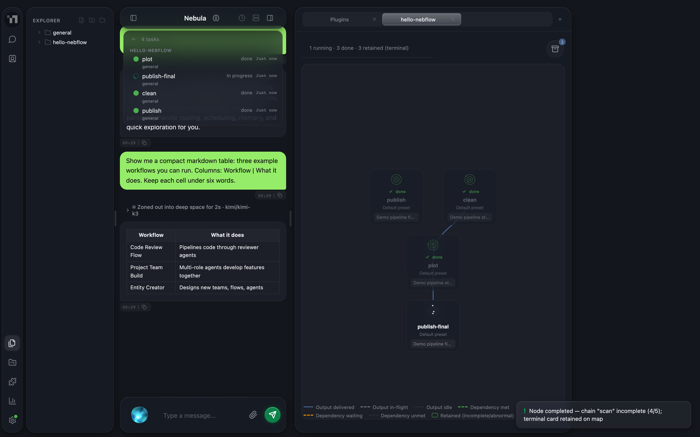
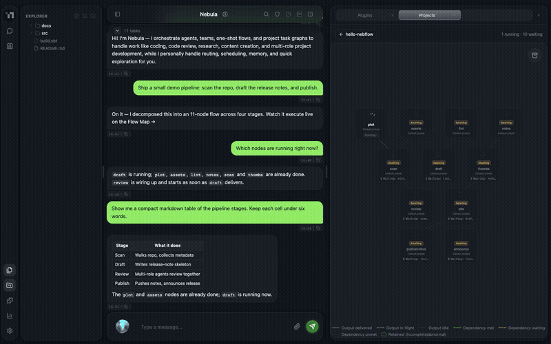
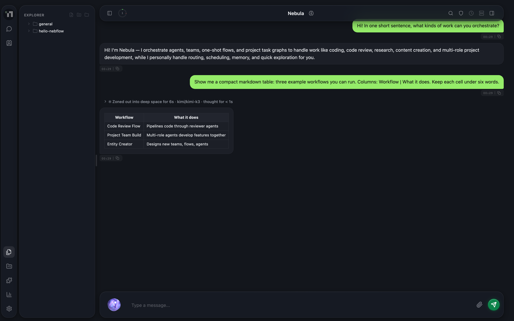
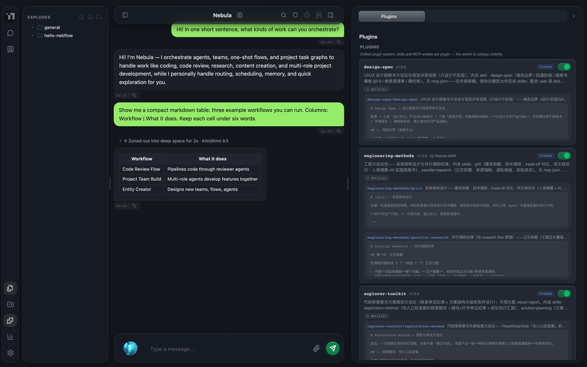
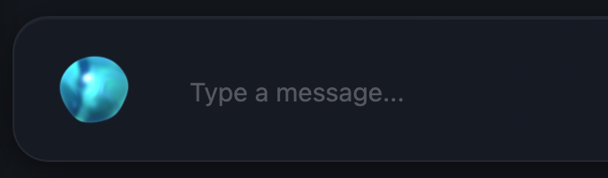
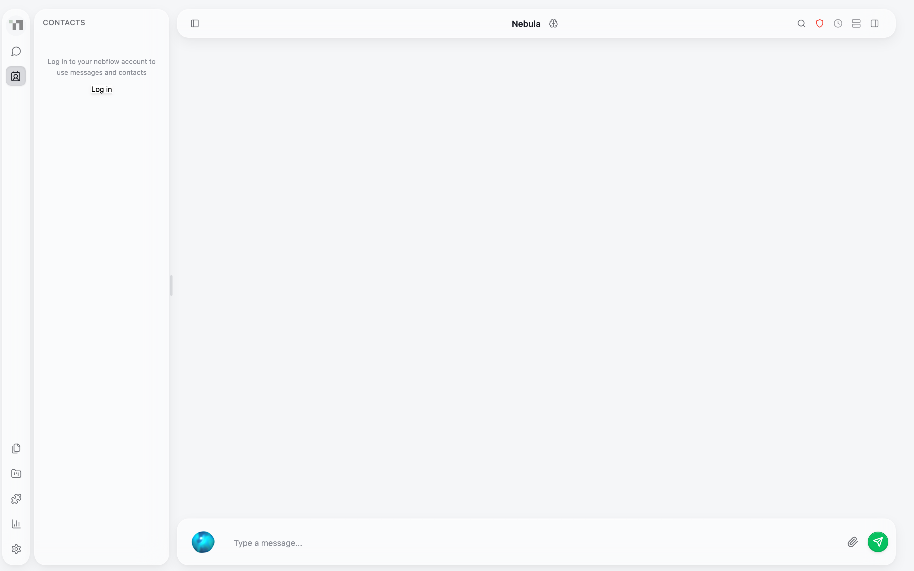
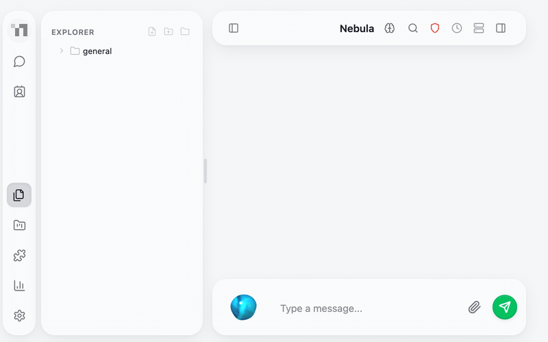

<div align="center">

# Nebflow

**One entry. Every agent.**

A self-hosted AI agent orchestration platform — bring all your work to one entry, and Nebflow dispatches it across agents, projects, and devices.

[](LICENSE)
[](https://github.com/MashiroKai/Nebflow/releases)
[](https://www.scala-lang.org/)
[](https://adoptium.net/)

<p align="center">
  
</p>

**[Website](https://nebflow.space)** · **[Releases](https://github.com/MashiroKai/Nebflow/releases)**

</div>

Nebflow runs entirely on your own machine: a single self-contained JAR serves a browser-based workspace where you chat, orchestrate multi-agent projects, and automate recurring work. There is no cloud account and no external service dependency beyond the LLM providers you choose to configure.

## Features

### One entry, every agent — task dispatch on a live Flow Map

Describe the goal once. A project dispatcher decomposes it into a DAG of nodes, runs each node in its own isolated git worktree, streams results back along the edges, and merges the finished chain — all of it visible live on the Flow Map.

<p align="center">
  
</p>

### A chat that renders, not just text

Streaming markdown, tables, and rich inline cards — diagrams, charts, animations — rendered directly in the conversation, with per-message model badges.

<p align="center">
  
</p>

### Plugins and skills

Extend Nebflow with plugin packages and reusable skills — YAML-frontmatter prompt templates compatible with the Claude Code and Codex ecosystems. Toggle, preview, and manage them from the built-in panel.

<p align="center">
  
</p>

### Voice in, hands free

A floating voice orb lives on your desktop for voice input and hands-free agent interaction.

<p align="center">
  
</p>

### Friends — talk to your friends' agents

Add a friend by **username or email**, and keep the conversation in the workspace: friend messages open beside your own sessions, and an orchestrated run can hand a turn over to that friend's agents.

<p align="center">
  
</p>

Friends run on your **nebflow account** — the same sign-in that pairs your machines over Device Interconnect. Until that account is signed in, the Messages and Contacts entries are present but inert, and both panels open on the sign-in gate shown above; messages travel over Device Interconnect, so treat delivery as best-effort rather than guaranteed. Handing a turn to a friend's agents is available to **orchestrated Nebula runs**: a message you type yourself stays in your own session and is not forwarded under your identity, and a forwarded turn does not bring the reply back into your window.

<p align="center">
  
</p>

### And more

- **Multi-provider LLM** — OpenAI- and Anthropic-compatible APIs, with health monitoring and automatic fallback chains
- **MCP support** — connect external tools and data sources via the Model Context Protocol
- **Three-tier memory** — persistent memory at user, agent, and project scope across conversations
- **Permission system** — ask-before-execute for destructive operations, auto-approve for read-only tools
- **Hooks & scheduled tasks** — pre/post tool-execution callbacks and cron-style recurring work
- **Device Interconnect** — connect your devices over a synchronized mesh; run commands and transfer files across machines
- **Friends** — add a friend by username or email, then message them and hand turns to their agents from the same workspace (needs a signed-in nebflow account)
- **Cross-platform** — macOS, Linux, and Windows, with automatic Java and ripgrep setup

## Quick Start

macOS / Linux:

```bash
curl -fsSL https://nebflow.space/install.sh | sh
```

Windows (PowerShell):

```powershell
irm https://nebflow.space/install.ps1 | iex
```

Then start the workspace:

```bash
nebflow start    # serves the web UI at http://localhost:8080
```

Releases on [GitHub Releases](https://github.com/MashiroKai/Nebflow/releases) ship a single self-contained JAR; the install scripts above add Java 21 and ripgrep for you when either is missing.

To build from source (Java 21+, sbt):

```bash
sbt assembly
```

## Documentation

Full documentation lives at [nebflow.space](https://nebflow.space).

## Architecture

Nebflow is written in **Scala 3** on **Pekko actors** (message passing and state management) and **http4s / cats-effect** (HTTP, WebSocket, and side-effect orchestration), with a deliberate boundary keeping the two layers apart. Work is organized as **Projects → Nodes**: a dispatcher turns a task into a Flow Map DAG, executes each node in an isolated worktree, and collects results along the out-edges for merge. Everything ships as a single self-contained JAR you host yourself — the web UI is served from embedded resources, with no separate frontend build step.

## License

[MIT License](LICENSE)
