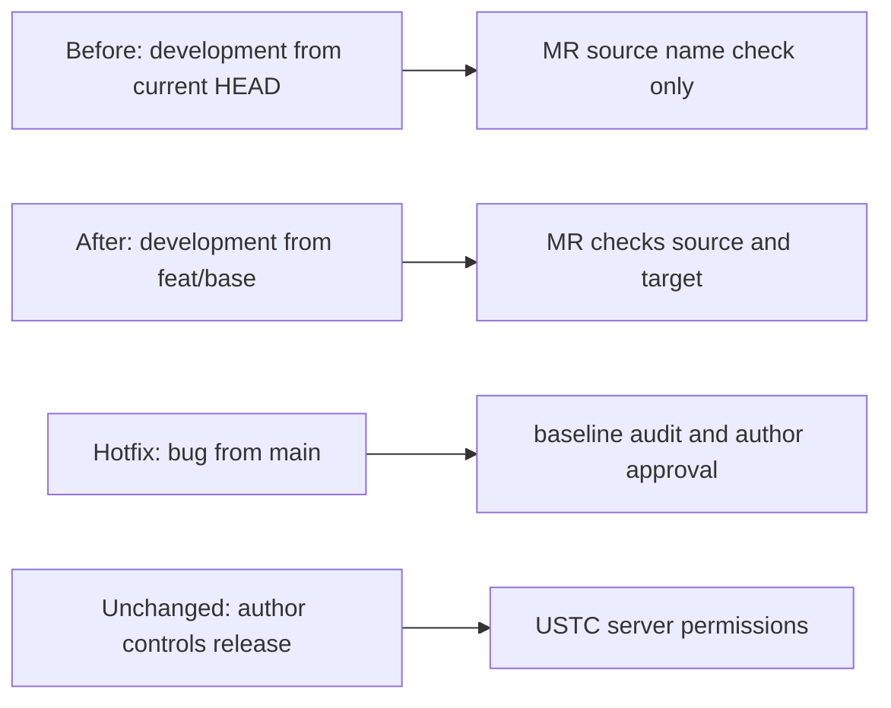

# Behavior comparison

```mermaid
flowchart LR
  O[Before: development from current HEAD] --> P[MR source name check only]
  N[After: development from feat/base] --> Q[MR checks source and target]
  H[Hotfix: bug from main] --> A[baseline audit and author approval]
  U[Unchanged: author controls release] --> S[USTC server permissions]
```
