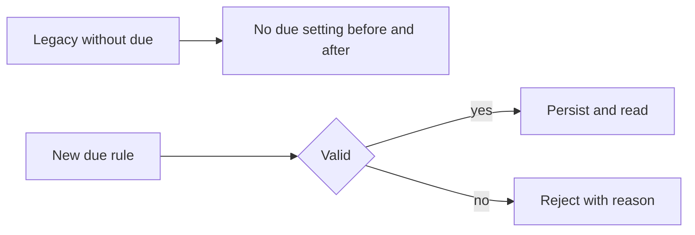

# Behavior comparison

```mermaid
flowchart LR
  A[Legacy without due] --> B[No due setting before and after]
  C[New due rule] --> D{Valid}
  D -->|yes| E[Persist and read]
  D -->|no| F[Reject with reason]
```
