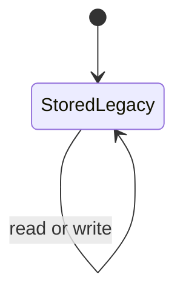
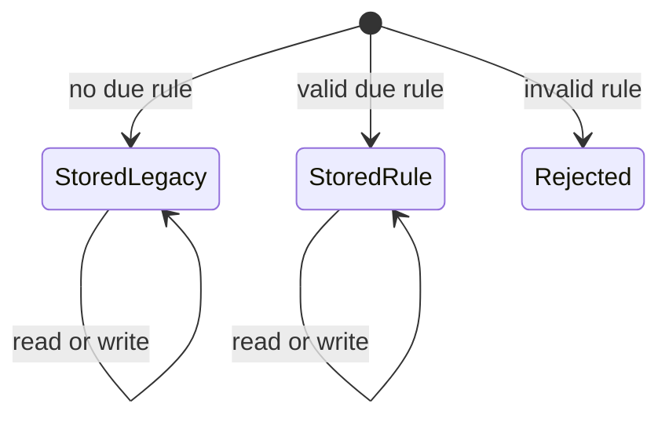

# State machine

Before:

```mermaid
stateDiagram-v2
  [*] --> StoredLegacy
  StoredLegacy --> StoredLegacy: read or write
```

After:

```mermaid
stateDiagram-v2
  [*] --> StoredLegacy: no due rule
  [*] --> StoredRule: valid due rule
  [*] --> Rejected: invalid rule
  StoredLegacy --> StoredLegacy: read or write
  StoredRule --> StoredRule: read or write
```
