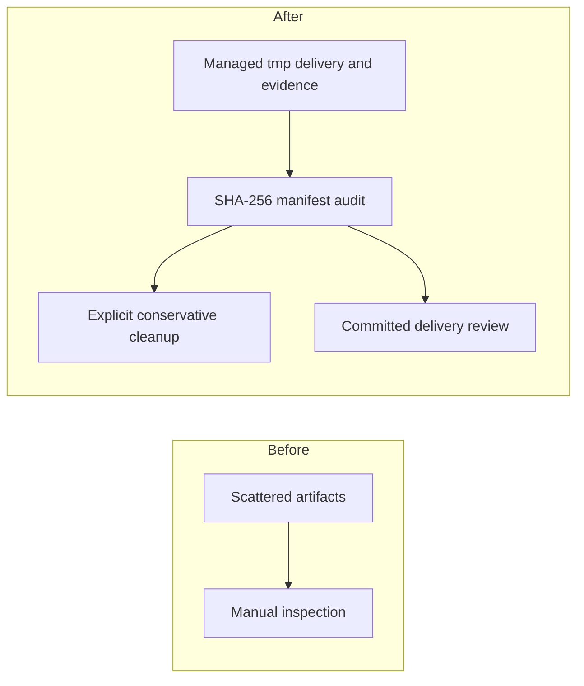

# Behavior

```mermaid
flowchart LR
  subgraph Before
    A[Scattered artifacts] --> B[Manual inspection]
  end
  subgraph After
    C[Managed tmp delivery and evidence] --> D[SHA-256 manifest audit]
    D --> E[Explicit conservative cleanup]
    D --> F[Committed delivery review]
  end
```
