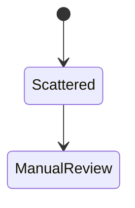
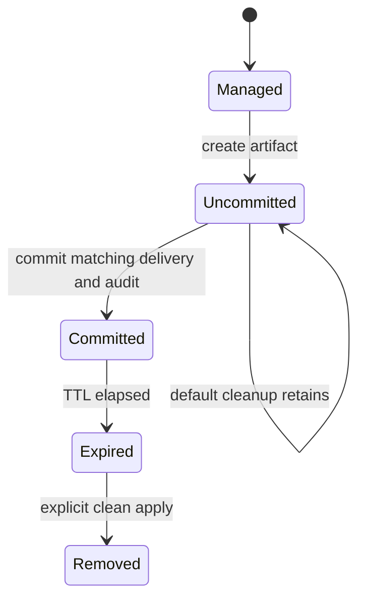

# State machine

## Before

```mermaid
stateDiagram-v2
  [*] --> Scattered
  Scattered --> ManualReview
```

## After

```mermaid
stateDiagram-v2
  [*] --> Managed
  Managed --> Uncommitted: create artifact
  Uncommitted --> Committed: commit matching delivery and audit
  Committed --> Expired: TTL elapsed
  Expired --> Removed: explicit clean apply
  Uncommitted --> Uncommitted: default cleanup retains
```
