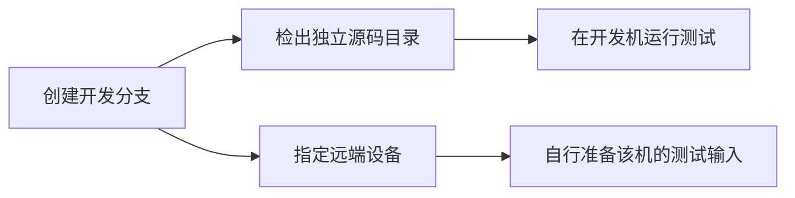
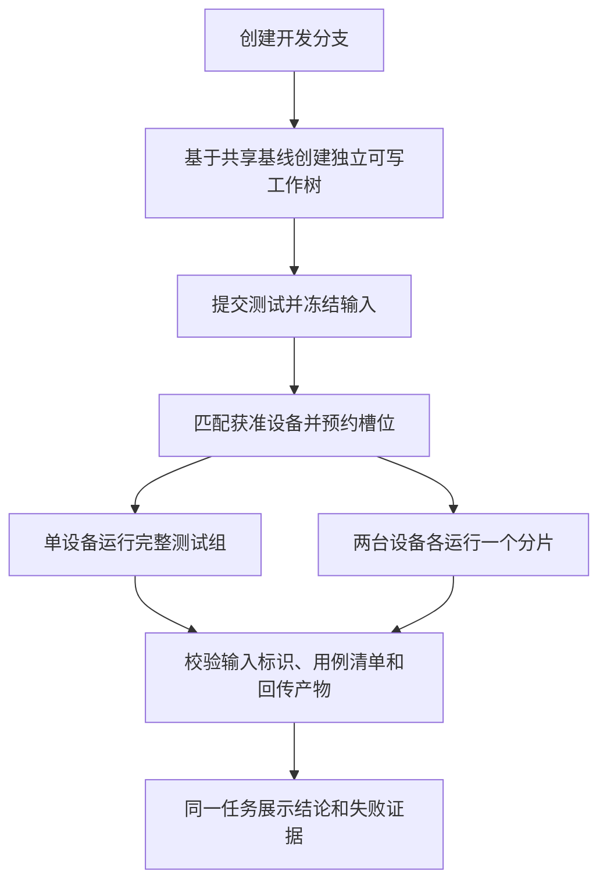

# 用户操作与系统行为

## Before

通常每个开发分支物化一个工作目录，并在开发机内串行跑受隔离条件约束的测试。现有跨机工具可以在指定设备执行命令，调用者负责准备输入和核对结果。

```mermaid
flowchart LR
    A["创建开发分支"] --> B["检出独立源码目录"]
    B --> C["在开发机运行测试"]
    A --> D["指定远端设备"]
    D --> E["自行准备该机的测试输入"]
```

## After

目标流程中，创建轻量工作树时在同一卷上复用基线。提交测试时取当时可见内容的快照，此后的编辑属于下一次提交。设备槽位和测试结果按作业尝试跟踪。

```mermaid
flowchart TD
    A["创建开发分支"] --> B["基于共享基线创建独立可写工作树"]
    B --> C["提交测试并冻结输入"]
    C --> D["匹配获准设备并预约槽位"]
    D --> E["单设备运行完整测试组"]
    D --> F["两台设备各运行一个分片"]
    E --> G["校验输入标识、用例清单和回传产物"]
    F --> G
    G --> H["同一任务展示结论和失败证据"]
```
